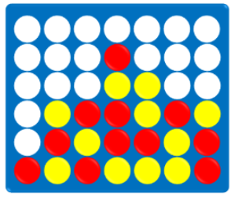

Implement a program that creates a Minimax agent for the game Connect 4. An implementation of the game board is already provided (file board.py), which defines the game rules and some useful methods. Additionally, create an agent that represents the user (a human player) and test the Minimax agent in a match against it.

The game should be played on a 3x3 board, and a win is achieved by connecting three identical tokens in a row (vertically, horizontally, or diagonally).

It is noticeable that a classic Minimax agent requires a lot of time to make a move on any board larger than 3x3. Therefore, implement the following modifications that improve the performance of the algorithm:

* Alpha-beta pruning
* Limiting the search depth

