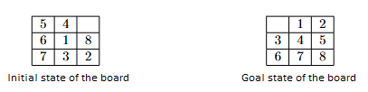

Implement the informed search algorithms (GBFS and A*) to solve the 8-puzzle problem.
Define a heuristic function that, for each number on the board, computes the Manhattan distance from the position where that number should be located.

An implementation of the board (board.py) is provided, representing the 8-puzzle board and defining several helper methods.
The initial and goal states of the board are given in the tables below.

In each move, a single tile can be moved into the empty space, provided it is adjacent to it.
The cost of every move is 1.

For each solution, print all states and actions, in order, that must be traversed to reach the solution.
Additionally, for both algorithms, print:

the path length from the initial to the goal state

the number of states visited during the search

Compare the values obtained with GBFS and A*.
Which algorithm guarantees an optimal solution in terms of the number of moves required to reach the goal state, and which algorithm finds any (possibly non-optimal) solution faster?

